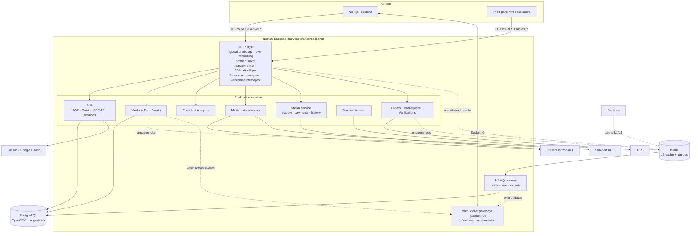

# Architecture Diagram

Rendered with Mermaid — edit the source, not an image. This reflects
components that actually exist in `harvest-finance/backend/src` today.

## System overview



## Request flow (versioned REST)

```
Client
  → GET /api/v1/vaults  (Authorization: Bearer <jwt>)
  → global middleware: request validation, pino-http logging (x-request-id)
  → ThrottlerGuard (short/medium/long tiers)
  → URI versioning router + VersioningInterceptor (X-API-Version /
    Deprecation / Sunset headers)
  → JwtAuthGuard → RolesGuard (route-specific)
  → ValidationPipe transforms/whitelists DTO
  → controller → service → repository/cache
  → ResponseInterceptor wraps payload
  → JSON response (+ version headers)
```

## Persistence flow

- Services write through TypeORM repositories/transactions to **PostgreSQL**.
- Schema changes ship as TypeScript **migrations** applied via
  `npm run migration:run` (`src/database/data-source.ts`); runtime
  synchronization is off.
- Read-heavy lookups consult the two-level cache first
  ([ADR](adr/2026-08-24-caching-strategy.md)): in-process L1 → Redis L2 →
  database.

## External service interaction

| Dependency | Used by | Notes |
|------------|---------|-------|
| Stellar Horizon | Stellar service, multi-chain Stellar adapter, health check | Transient failures retried per `src/stellar/utils/stellar-retry.ts`; circuit breaker config via `STELLAR_CIRCUIT_*` |
| Soroban RPC | Event indexer, contract reads | Optional locally (`SOROBAN_RPC_URL`) |
| OAuth providers | Auth module | Google/GitHub callbacks |
| IPFS | Delivery verification proofs | Optional |

## Asynchronous communication

- **BullMQ** on Redis carries `notifications` and `exports` jobs
  (attempts: 3, exponential backoff). Workers run inside the backend process.
- Domain events flow to WebSocket rooms from services/workers so clients see
  deposit/withdrawal/harvest activity without polling.

## Health & metrics surfaces

- `GET /health` — DB ping, Redis ping, Horizon ledger probe, payment-stream
  status (see [health-checks.md](health-checks.md)).
- `GET /metrics` — Prometheus exposition (see [metrics.md](metrics.md)).
